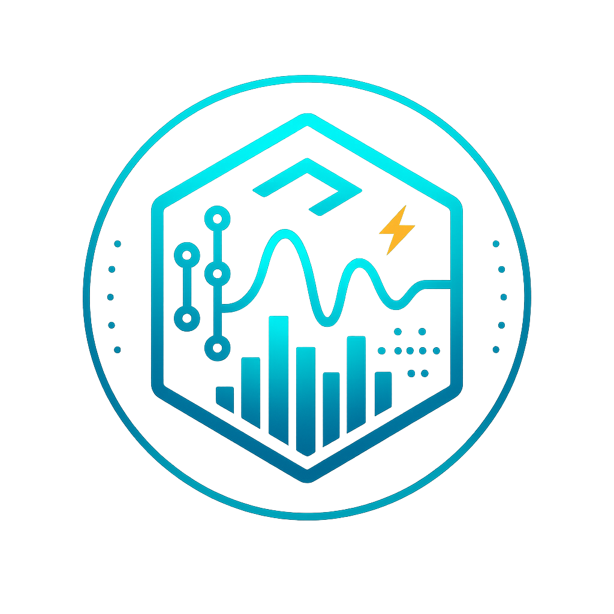

<div align="center">
  
  <h1>zdsp</h1>

  
  
  
  
</div>

**Digital Signal Processing library for audio applications**

zdsp provides high-performance, real-time audio processing components for effects, filters, analysis, and synthesis. Built with Zig for maximum performance and memory safety.

## Features

- **Effects**: Delay, reverb, distortion, compressor, limiter
- **Filters**: Biquad filters (lowpass, highpass, peaking EQ), IIR/FIR, Butterworth, Chebyshev
- **Analysis**: FFT/IFFT, spectral analysis, pitch detection, onset detection
- **Synthesis**: Oscillators (sine, saw, square, triangle), noise generators, granular synthesis
- **Real-time**: Optimized for low-latency audio processing and convolution

## Quick Start

```zig
const std = @import("std");
const zdsp = @import("zdsp");

pub fn main() !void {
    const allocator = std.heap.page_allocator;

    // Create oscillator
    var osc = zdsp.synthesis.Oscillator.init(44100.0);
    osc.setFrequency(440.0);

    // Create filter
    var filter = zdsp.filters.BiquadFilter{};
    filter.setLowpass(44100.0, 1000.0, 0.707);

    // Create delay effect
    var delay = try zdsp.effects.Delay.init(allocator, 4410);
    defer delay.deinit();

    // Process audio
    const input = osc.sineFrame();
    const filtered = filter.process(input);
    const output = delay.process(filtered);
}
```

## Build

```bash
zig build        # Build library
zig build run    # Run example
zig build test   # Run tests
```

## Installation

Add to your Zig project:

```bash
zig fetch --save https://github.com/ghostkellz/zdsp/archive/refs/heads/main.tar.gz
```

## Audio Ecosystem

zdsp is part of a focused audio processing ecosystem:

- **[beatZ](https://github.com/ghostkellz/beatz)**: Audio device I/O, MIDI processing, low-latency streams
- **[zcodec](https://github.com/ghostkellz/zcodec)**: Audio format encoding/decoding, metadata handling
- **zdsp**: Digital signal processing, effects, filters, synthesis (this library)

---

<div align="center">
  Built with Zig ⚡
</div>
